# AHBesser (AHB-Tabellen) Web Application

## ℹ️ Overview

### Production

You can access the **prod** version of the application on [ahb-tabellen.hochfrequenz.de](https://ahb-tabellen.hochfrequenz.de).

### Stage

You can access the **stage** version of the application on [ahb-tabellen.stage.hochfrequenz.de](https://ahb-tabellen.stage.hochfrequenz.de).

This is our test environment where we deploy the latest changes to test them before deploying them to production.

### 🏛 Architecture

```mermaid
flowchart TD
    A("edi-energy-mirror:
    raw documents (PDF, docx)") -->|kohlrAHBi🥬| B("machine-readable-
    anwendungshandbücher")
    B -->|sync upload🔄| C("Azure Blob Storage")
    C <--> D("AHBesser
    (AHB tables)")
```



### 📂 Project Structure

```plaintext
.
├── azure-mock/
    ├── data/                     # contains AHB data stored in machine-readable_anwendungshandbuecher repository
    └── upload-documents.ts       # script to upload data/ directory to azure blob storage
├── src/
    ├── app/
        ├── core/
            └── api/              # API config files
        ├── environments/         # config files for dev/stage/prod
        ├── features/             # AHB and landingpage related views and components
        └── shared/               # global components (header, footer, logo, etc.)
    ├── assets/                   # logo, favicon, etc.
    ├── server/
        ├── controller/           # contains code to handle incoming http requests concerning AHB and FormatVersionen
        ├── infrastructure/       # contains code to manage routing of API endpoints and interact with azure blob storage
        └── repository/           # contains CRUD operations to register AHB/FormatVersionen related routers
    ├── index.html                # entry point for the angular web application
    ├── main.ts                   # bootstraps the angular web application
    ├── server.ts                 # sets up backend server
    └── styles.scss               # imports Tailwind base styles, component styles and utility classes
└── ⚙️ <several config files>
```

## ⚙️ Setup

Make sure you have the latest version of [node.js](https://nodejs.org/en) installed (for instance via the [node version manager](https://github.com/nvm-sh/nvm) `nvm`).

Download and install [Angular CLI](https://v17.angular.io/cli) using the `npm` package manager (comes with node.js):

```bash
$ npm install -g @angular/cli
```

[**Windows**] Add node.js to your PATH environment variable:

- run `$ npm config get prefix` to retrieve the directory where npm will install global packages (e.g. `C:\Program Files\nodejs`)
- open "Edit the system environment variables" and navigate to "Environment Variables" -> "System Variables" -> "Path"
- edit "Path" and add the node.js directory path
- restart your PC and check if Angular CLI has been installed successfully by running `$ ng --version`

> [!NOTE]
> Be sure to run `$ npm ci` during the initial setup to install all required dependencies.

### Starting the app via Docker 🐋

Create an `.env` file in the root directory and paste the contents of the `.example.env` file.

> [!IMPORTANT]
> The application requires a SQLite database to function.
> This database is stored in an encrypted 7z archive at `src/server/data/ahb.db.encrypted.7z`.
> You will need the password to decrypt this archive, which can be found in the Hochfrequenz 1Password vault at [this link](https://start.1password.com/open/i?a=F35NURJ4PFGOPBA77PR66C5P4I&v=vjgfwz7dg5wg656rfpvadetrqy&i=grnjb4hn6ipcau4bqe43rkuwnq&h=hochfrequenz.1password.com).
>
> If you don't have access to the 1Password vault, please ask your teamates how to get the password.
>
> To work locally, you need to decrypt the archive and store the decrypted file in at `src/server/data/ahb.db`.
>
> If you want to start the application with Docker, you need to set the `DB_7Z_ARCHIVE_PASSWORD` environment variable in the `docker-compose.yaml` file either by setting it directly or by using the `.env` file.
> We recommend the latter to keep the `docker-compose.yaml` file clean and readable.

While having [Docker Desktop](https://www.docker.com/products/docker-desktop/) up and running, start the docker container using

```bash
$ docker compose up -d --build
```

and navigate to `http://localhost:4000/`.

### Starting the app using Angular CLI

To start a dev server, run

```bash
$ ng serve
```

and navigate to `http://localhost:4200/`.
The application will automatically reload if you change any of the source files.

In order to start both the dev server as well as the server-side watch process to access the blob storage, run

```shell
$ npm run start
```

For further commands, refer to the scripts located in `package.json`.

## 🛠️ Build & Development

### Code scaffolding

Run `ng generate component component-name` to generate a new component. You can also use `ng generate directive|pipe|service|class|guard|interface|enum|module`.

### Build

Run `ng build` to build the project. The build artifacts will be stored in the `dist/` directory.

### Running unit tests

Run `ng test` to execute the unit tests via [Karma](https://karma-runner.github.io).

### Running end-to-end tests

Run `ng e2e` to execute the end-to-end tests via a platform of your choice. To use this command, you need to first add a package that implements end-to-end testing capabilities.

### OpenAPI Specification Generation

Run `npm run ng-openapi-gen` to generate the OpenAPI specification and related TypeScript interfaces. This command will update the API client code based on the OpenAPI specification.

## 🚀 Deployment

The application can be deployed to two environments: Stage and Production.
The deployment process is automated using a combination of GitHub Actions, Pulumi, and Octopus Deploy.

### Deployment Process Overview

1. **Build**: GitHub Actions builds a Docker image and pushes it to the GitHub Container Registry
2. **Infrastructure**: Pulumi manages the Azure resources
3. **Deployment**: Octopus Deploy handles the container deployment to Azure by using Pulumi.

### Stage Deployment

To deploy to the stage environment:

1. Create a new release in GitHub
2. Set the release as "Pre-release"
3. This will automatically trigger the deployment pipeline
4. The application will be deployed to [ahb-tabellen.stage.hochfrequenz.de](https://ahb-tabellen.stage.hochfrequenz.de)

### Production Deployment

To deploy to the production environment:

1. Create a new release in GitHub
2. Publish it as a full release (not pre-release)
3. This will trigger the production deployment pipeline
4. A manual approval step in Octopus Deploy will be required
5. After approval, the application will be deployed to [ahb-tabellen.hochfrequenz.de](https://ahb-tabellen.hochfrequenz.de)

## 🔗 Links

- Generate machine-readable files from AHB documents with [KohlrAHBi](https://github.com/Hochfrequenz/kohlrahbi) 🥬.
- Official edi@energy AHB documents are provided by BDEW at [edi-energy.de](https://www.edi-energy.de/index.php?id=38).
- To get more help on the Angular CLI use `ng help` or go check out the [Angular CLI Overview and Command Reference](https://angular.io/cli) page.
